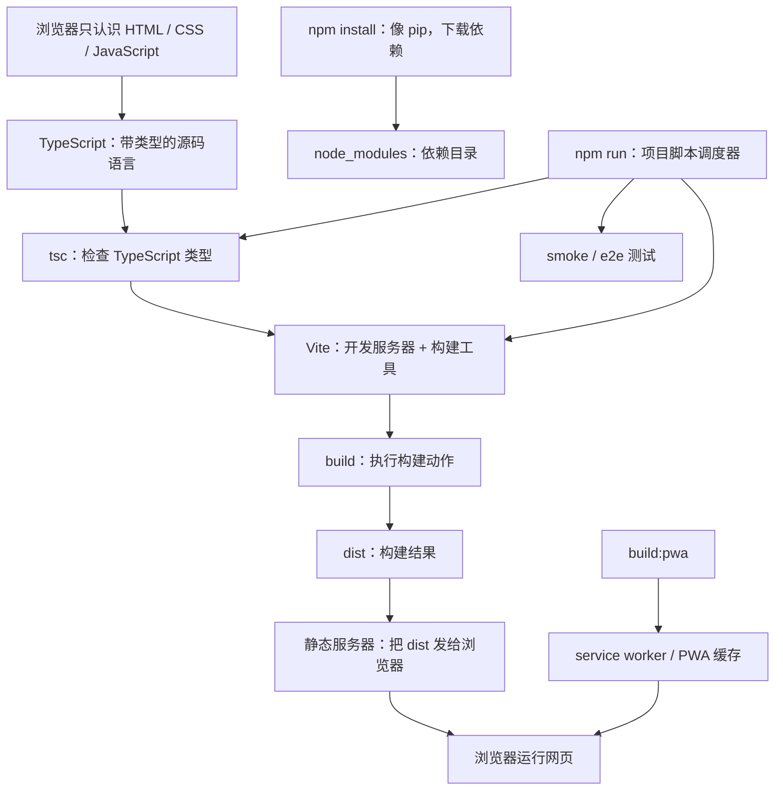

# 前端项目基础概念入门：用游戏开发与 Python 经验理解 Guitar Lab

> 面向：熟悉一些游戏开发、UE 项目结构、Python 脚本、Flask 简单站点，但不熟悉现代前端工程的人。
> 目标：按“依赖关系顺序”解释 TypeScript、tsc、Vite、npm、build、dist、PWA、service worker、smoke test。

---

## 0. 一句话总览

Guitar Lab 这个前端项目可以粗略理解成：

```text
TypeScript/React 源码
  -> tsc 做类型检查
  -> Vite 打包成 dist
  -> 静态服务器把 dist 提供给浏览器
  -> 浏览器运行最终的 HTML/CSS/JS
```

`npm` 本身不是编译器，也不是服务器。它更像一个项目级工具调度器，同时也负责下载依赖。

---

## 1. 先从你熟悉的类比开始

### 1.1 和 Python 的类比

| 前端项目 | Python 类比 | 说明 |
|---|---|---|
| `node` / `node.exe` | `python` / `python.exe` | JavaScript 运行时，能执行 JS 脚本 |
| `npm` 下载依赖 | `pip` | 从包仓库安装第三方库 |
| `package.json` | `pyproject.toml` / `requirements.txt` 的一部分 | 记录依赖和项目脚本 |
| `node_modules/` | Python 虚拟环境里的 site-packages | npm 下载的依赖实际存放处 |
| `npm run xxx` | 项目里的 Makefile / invoke / 自定义脚本入口 | 按名字运行项目脚本 |
| `tsc` | `mypy` + 一部分编译步骤 | 检查 TypeScript 类型，必要时编译 |
| `vite build` | 打包/烘焙脚本 | 把源码加工成浏览器可用的发布文件 |
| `dist/` | 打包后的 release 目录 | 最终给用户或服务器使用的文件 |

你说“npm 下载和管理依赖像 pip”是对的。

但“npm 命令入口类似 python.exe”要稍微拆开：

- `node.exe` 更像 `python.exe`：它是实际运行 JavaScript 的程序。
- `npm` 更像 `pip + 项目脚本启动器`：既能安装包，也能根据 `package.json` 调用其他工具。

例如：

```bash
npm run build
```

不是 npm 自己在编译代码，而是 npm 找到 `package.json` 里的 `build` 脚本，然后调用：

```bash
tsc && vite build
```

### 1.2 和 UE / 游戏项目的类比

| 前端项目 | UE / 游戏开发类比 | 说明 |
|---|---|---|
| `src/` | 游戏源代码和资源编辑目录 | 平时开发改这里 |
| `TypeScript` | C++ / 蓝图脚本的一种源码语言 | 人写的源代码，不是最终发布形态 |
| `tsc` | 编译检查 / UBT 的一部分 | 先检查代码是否合法 |
| `Vite` | Cook / Package 工具链 | 把开发形态加工成可运行发布形态 |
| `dist/` | 打包后的 WindowsNoEditor / Shipping 包 | 最终被服务器提供给浏览器 |
| `start-server.bat` | 双击启动本地测试包 | 窗口开着服务运行，窗口关了服务停 |
| PWA 缓存 | 平台本地缓存 / 已安装 App 的资源缓存 | 有时会让你看到旧版本 |

这也是为什么不要手改 `dist/`：它更像 Cook 出来的结果。真正要改功能，应该改 `src/`。

---

## 2. 第一层：浏览器真正认识什么

浏览器最终认识的是：

- HTML
- CSS
- JavaScript
- 图片、字体、音频等静态资源

它不直接认识 TypeScript，也不直接运行 React 组件源码。

所以现代前端工程的核心问题是：

> 我们写的高级源码，如何变成浏览器能加载的 HTML/CSS/JS？

这就引出了 TypeScript、tsc、Vite。

---

## 3. 第二层：TypeScript 是什么

TypeScript 可以先用 Python + Type Hint 来类比。

Python 可以这样写：

```python
def add(a, b):
    return a + b
```

加上 Type Hint 后可以写成：

```python
def add(a: int, b: int) -> int:
    return a + b
```

TypeScript 和这个思路很像：它也是在原本灵活的动态语言上，加一层类型标注。

普通 JavaScript 可以这样写：

```js
function add(a, b) {
  return a + b;
}
```

TypeScript 可以写成：

```ts
function add(a: number, b: number): number {
  return a + b;
}
```

所以可以粗略理解成：

```text
Python + Type Hint 约等于 更可检查的 Python
JavaScript + TypeScript 约等于 更可检查的 JavaScript
```

不过两者也有一个重要差异：

- Python 的 Type Hint 通常不会改变 Python 的运行方式，主要交给 `mypy`、编辑器或框架读取。
- TypeScript 源码通常需要经过工具处理，去掉类型标注后变成浏览器能运行的 JavaScript。

这里的 `number`、`NoteName`、`MvpQuestionType` 等类型，对浏览器本身没用，主要对开发者和工具有用：

- 提前发现传参错误。
- 让编辑器自动补全更准确。
- 让复杂数据结构更可控。

Guitar Lab 里有音名、唱名、弦、品、题型、答题记录等结构。用 TypeScript 可以减少很多“拼错字段名还不知道”的问题。

---

## 4. 第三层：tsc 是什么

`tsc` 是 TypeScript Compiler，TypeScript 编译器。

在本项目中，`tsc` 主要负责：

```text
检查 TypeScript 类型是否正确
```

例如：

```bash
npm run build
```

会先执行：

```bash
tsc
```

如果类型错误，构建会直接停下。

可以把它类比成：

- Python 项目里的 `mypy` 类型检查。
- UE C++ 项目里编译前发现类型不匹配。
- 游戏脚本导出前的合法性检查。

重要的是：`tsc` 不负责启动网页服务器，也不负责 PWA 缓存。它只关心 TypeScript 是否站得住。

---

## 5. 第四层：Vite 是什么

Vite 是前端构建工具和开发服务器。

你以前看 npm 相关前端内容时没看到 Vite，并不奇怪。前端工具链换代很快，不同年代、不同框架教程会出现不同工具：

| 你可能见过的名字 | 大概是什么 | 常见场景 |
|---|---|---|
| Webpack | 老牌、能力很强的打包工具 | 很多中大型老项目、早期 React/Vue 工程 |
| Create React App | 早期 React 官方推荐脚手架 | 老一些的 React 入门教程 |
| Parcel | 偏零配置的打包工具 | 一些轻量项目或早期现代化尝试 |
| Next.js | React 全栈框架 | 需要路由、服务端渲染、后端接口时 |
| Vite | 现代轻量开发服务器 + 构建工具 | 新 React/Vue/Svelte 项目、很多前端库和工具项目 |

所以 Vite 不是所有前端项目都一定会用的底层标准，但它已经是现代前端项目里非常常见的选择。尤其是：

- 新建一个普通 React/Vue/Svelte 单页应用。
- 希望开发服务器启动快、热更新快。
- 不想一开始就写复杂 Webpack 配置。
- 项目主要是前端静态应用，而不是完整全栈框架。

换成游戏开发类比：

> Vite 不是“C++ 编译器”这种绕不开的底层语言工具，更像“某一代很流行、很好用的项目构建/打包工具链”。有些项目用它，有些项目用 Webpack、Next.js、Rspack、Turbopack 或别的工具。

它有两个主要身份。

### 5.1 开发服务器

命令：

```bash
npm run dev
```

通常会调用：

```bash
vite
```

这时 Vite 会启动开发服务器。它适合写代码时使用，特点是快、支持热更新。

### 5.2 构建工具

命令：

```bash
npm run build
```

里面会调用：

```bash
vite build
```

这时 Vite 会把源码打包到 `dist/`。

可以把 `vite build` 类比为游戏里的 Cook / Package：

```text
开发源文件
  -> 处理 import
  -> 合并模块
  -> 压缩资源
  -> 生成最终发布目录 dist
```

---

## 6. 第五层：npm 如何驱动这些工具

现在再看 npm，会清晰很多。

`npm` 有两类职责。

### 6.1 下载和管理依赖

这部分像 `pip`。

例如：

```bash
npm install
```

它会读取：

```text
package.json
package-lock.json
```

然后把依赖下载到：

```text
node_modules/
```

`node_modules/` 很像 Python 虚拟环境里的依赖目录，不应该提交到 Git。

### 6.2 运行项目脚本

这部分像项目里的 Makefile、UE 工具按钮、Python 自定义脚本入口。

本项目的 `package.json` 里有：

```json
{
  "scripts": {
    "dev": "vite",
    "build": "tsc && vite build",
    "build:pwa": "tsc && vite build --mode pwa",
    "preview:static": "node scripts/static-preview.mjs",
    "test:smoke": "node scripts/smoke-dist.mjs",
    "test:e2e": "playwright test"
  }
}
```

所以：

```bash
npm run dev
```

实际含义是：

```text
npm 读取 package.json
  -> 找到 scripts.dev
  -> 执行 vite
  -> Vite 启动开发服务器
```

而：

```bash
npm run build
```

实际含义是：

```text
npm 读取 package.json
  -> 找到 scripts.build
  -> 执行 tsc
  -> 如果 tsc 成功，再执行 vite build
```

这里刚好对应 Vite 的两个身份：

- `npm run dev` 调用 `vite`：启动开发服务器，适合一边写代码一边看效果。
- `npm run build` 调用 `vite build`：生成 `dist/` 构建产物，适合预览、测试或发布前使用。

npm 是调度者，不是每件事的执行者。

---

## 7. 第六层：build 和 dist

`build` 是动作，`dist` 是结果。

```bash
npm run build
```

会生成：

```text
dist/
```

`dist/` 里面通常有：

```text
index.html
assets/*.js
assets/*.css
manifest.webmanifest
sw.js
```

浏览器访问本地服务器时，实际拿到的是 `dist/` 里的这些文件。

你可以这样理解：

```text
src/ 是工程项目
dist/ 是打包后的可运行版本
```

这和游戏开发里的“工程目录”和“打包后的可执行版本”很像。

---

## 8. 第七层：服务器在这里做什么

本项目当前不是 Flask 那种后端动态渲染网页。

本地预览服务器只做一件事：

> 把 `dist/` 目录里的静态文件通过 HTTP 发给浏览器。

我们现在有：

```text
start-server.bat
```

双击后它会：

1. 检查是否已有服务器。
2. 如果没有 `dist/index.html`，先运行 `npm run build`。
3. 调用 `npm run preview:static`。
4. 打开一个前台窗口提供 `http://127.0.0.1:4173/`。
5. 关闭窗口，服务器停止。

这和运行 Flask 很像：

```text
python app.py
```

只是 Flask 通常会运行 Python 后端逻辑，而这里的静态服务器只发文件。

---

## 9. 第八层：PWA 是什么

PWA 是 Progressive Web App，中文常译为“渐进式 Web 应用”。

先把结论说清楚：

> PWA 是一个带本地缓存/安装能力的 Web App 发布形态。

它不是一个单独的工具，不是一种服务器，也不等于 build。更完整地说，PWA 是一种“网页应用形态”：让网页在浏览器支持下，拥有一部分接近原生 App 的能力。

如果用游戏开发的语言讲，它更像：

> 浏览器提供了一套“可编程资源缓存/加载层”以及“网页 App 化声明”。这些能力组合起来，让网页客户端具备一部分本地完备性。

这里最核心的是：PWA 不负责替你写业务逻辑，它主要影响“资源怎么被加载、缓存、更新，以及网页能不能像 App 一样被安装/启动”。

### 9.1 用游戏开发类比

可以把 PWA / service worker 类比成游戏引擎里的资源加载与缓存系统。

```text
游戏上层逻辑：
  LoadAsset("event/old_map_03")

引擎资源层 / 虚拟文件系统：
  先查本地包体或缓存
  如果没有，再去 CDN 下载
  下载成功后保存到本地
  下次再请求同一资源，直接读本地
```

对应到网页：

```text
页面或浏览器：
  请求 /assets/app.js

Service Worker：
  先查浏览器缓存
  如果有，直接返回缓存
  如果没有，再请求服务器
  请求成功后可以写入缓存
  下次再请求同一资源，直接读本地
```

所以 PWA 不像“客户端变成服务器”，更像“浏览器里多了一层可编程的资源加载代理”。

这个类比尤其适合长线运营游戏：

```text
基础包体：
  包含核心启动资源。

按需下载：
  玩家进入某个旧活动或大地图时，再从服务器/CDN 下载对应资源。

本地缓存：
  下载过的资源下次直接读本地，减少等待和流量。
```

PWA 也是类似思路：核心页面资源可以提前缓存，其他资源可以在用户访问时再缓存。

### 9.2 PWA 由哪些东西组成

一个网页要变成 PWA，通常会涉及几类东西：

| 组成 | 它是什么 | 类比 |
|---|---|---|
| Web App Manifest | 一个描述 App 名字、图标、启动方式的 JSON 文件 | AndroidManifest / 应用描述文件 |
| Service Worker | 浏览器里的后台脚本，可以拦截请求、管理缓存 | 引擎资源层 / 虚拟文件系统代理 |
| Cache Storage | 浏览器提供的缓存仓库 | 本地资源缓存 |
| HTTPS / localhost | 浏览器要求的安全上下文 | 平台安全要求 |
| 构建插件 | 帮你生成 manifest、service worker 等文件的工具 | 打包流程里的自动化步骤 |

所以 PWA 不是其中任何单独一个东西，而是这些能力组合起来后的结果。

也可以这样对应：

| 游戏资源系统 | PWA / Service Worker |
|---|---|
| 包体内资源 | 预缓存的 HTML / JS / CSS |
| 按需下载资源 | 运行时缓存的图片、数据、代码 chunk |
| CDN / 资源服务器 | Web 服务器 |
| 本地资源缓存 | Cache Storage |
| 资源加载接口 | 浏览器的 HTTP 请求 / fetch |
| 虚拟文件系统 / Asset Manager | Service Worker |
| patch / 热更新版本 | 新 service worker + 新缓存版本 |

### 9.3 PWA 和 build 的关系

`build` 是“构建动作”：

```text
src -> dist
```

PWA 是“构建出来的网页是否带有 App 化能力”。

也就是前面那句话：

> PWA 是一个带本地缓存/安装能力的 Web App 发布形态。

本项目里：

```bash
npm run build
```

生成的是本地测试构建，默认不启用正式 PWA 缓存。

而：

```bash
npm run build:pwa
```

生成的是带 PWA 能力的正式构建。

所以更准确地说：

```text
build 是动作
PWA 是一种构建目标/应用形态
vite-plugin-pwa 是帮我们生成 PWA 相关文件的工具
service worker 是 PWA 常用的浏览器后台机制
```

换成游戏项目语言：

```text
build
  像：执行打包流程。

PWA
  像：选择一个带本地缓存/安装能力的 Web App 发布形态。

vite-plugin-pwa
  像：打包流程里的一个自动化插件，帮你生成 manifest、service worker、缓存清单。
```

### 9.4 PWA 和服务器的关系

PWA 不是服务器。

服务器仍然只负责把文件发给浏览器：

```text
服务器 -> index.html / JS / CSS / manifest / sw.js
```

真正让“离线还能打开”发生的，是浏览器里的 service worker 和缓存。

也就是说：

```text
第一次访问：
浏览器 -> 服务器 -> 下载页面和 PWA 文件 -> 注册 service worker -> 缓存资源

之后访问：
浏览器 -> service worker -> 如果缓存可用，可能直接返回缓存
```

这就是为什么服务器停了，浏览器仍然可能显示旧页面。

### 9.5 常见缓存策略

如果继续用游戏资源系统类比，PWA 常见缓存策略可以这样理解：

| 策略 | 前端含义 | 游戏资源类比 |
|---|---|---|
| Precache | 构建时列出核心资源，首次安装后提前缓存 | 基础包体里自带核心资源 |
| Runtime Cache | 用户访问到某些资源时再缓存 | 进入某个活动时按需下载资源 |
| Cache First | 优先读缓存，没有再请求网络 | 稳定资源优先读本地包 |
| Network First | 优先请求网络，失败再用缓存 | 活动配置优先拉最新，断网时用本地兜底 |
| Stale While Revalidate | 先用旧缓存快速显示，同时后台拉新版本 | 先用本地资源进场，后台静默更新资源 |

这些策略不是 PWA 自动替你决定的。开发者需要通过 service worker 或工具配置来选择。

### 9.6 PWA 能带来什么能力

用户能感受到的能力包括：

- 可以离线打开。
- 可以添加到桌面。
- 可以缓存 JS/CSS/HTML。
- 以后可用于移动端类 App 体验。

但这些能力不是凭空来的，它们依赖浏览器支持和正确配置。

### 9.7 为什么开发阶段容易被 PWA 坑

这对正式用户是好事，但对开发阶段有风险。

风险是：

> 你以为自己打开的是服务器返回的新页面，其实浏览器显示的是本地缓存旧页面。

用游戏资源系统类比：

> 你以为正在加载刚打出来的新资源，实际底层资源层命中了旧缓存。

这对长线运营游戏的正式环境可能是优化；但对开发调试来说，就是非常隐蔽的干扰。

所以我们现在的策略是：

- 日常 `npm run build`：不启用正式 PWA 缓存，并生成自毁型 `sw.js` 清旧缓存。
- 发布 `npm run build:pwa`：才生成真正的 PWA 离线缓存。

---

## 10. 第九层：service worker 是什么

service worker 是 PWA 的关键机制之一。

它不是服务器进程，而是浏览器内部注册的后台脚本。

普通网页请求：

```text
浏览器 -> 本地服务器 -> dist/index.html
```

有 service worker 后可能变成：

```text
浏览器 -> service worker -> 本地缓存 -> 旧的 index.html
```

这就是之前的怪现象：

> 没有启动 bat，也没有服务器进程，但浏览器仍然能看到网页。

原因不是服务器还活着，而是 service worker 或浏览器缓存把旧页面拿出来了。

这很像游戏里你以为加载了新 Pak，结果平台缓存、热更新缓存或安装目录残留让你看到旧资源。

### 10.1 一个 Hello World 级 service worker

下面是一个极简例子。它不依赖 React、Vite、PWA 插件，只展示 service worker 最核心的能力：

> 浏览器请求某个 URL 时，service worker 可以拦截这个请求，并自己返回内容。

假设有两个文件：

```text
index.html
sw.js
```

`index.html`：

```html
<!doctype html>
<html>
  <body>
    <h1>Service Worker Hello World</h1>
    <button id="load">请求 /hello.txt</button>
    <pre id="output"></pre>

    <script>
      if ('serviceWorker' in navigator) {
        navigator.serviceWorker.register('/sw.js');
      }

      document.querySelector('#load').addEventListener('click', async () => {
        const response = await fetch('/hello.txt');
        const text = await response.text();
        document.querySelector('#output').textContent = text;
      });
    </script>
  </body>
</html>
```

`sw.js`：

```js
self.addEventListener('fetch', (event) => {
  const url = new URL(event.request.url);

  if (url.pathname === '/hello.txt') {
    event.respondWith(new Response('Hello from service worker!'));
  }
});
```

这个例子里，服务器上不一定真的有 `/hello.txt` 文件。

流程是：

```text
页面点击按钮
  -> 页面 JS 调用 fetch('/hello.txt')
  -> 浏览器准备发请求
  -> service worker 收到 fetch 事件
  -> 发现路径是 /hello.txt
  -> 不请求服务器，直接返回 "Hello from service worker!"
```

这就是 service worker 的核心：它像一层位于浏览器请求和服务器之间的可编程代理。

和 Flask 的 Hello World 对比：

```python
from flask import Flask

app = Flask(__name__)

@app.route('/hello.txt')
def hello():
    return 'Hello from Flask!'
```

Flask 是服务器端返回内容：

```text
浏览器 -> Flask 服务器 -> 返回 Hello
```

service worker 是浏览器本地返回内容：

```text
浏览器 -> service worker -> 返回 Hello
```

所以 service worker 不是服务器，但它可以拦截浏览器请求，并在某些情况下不经过服务器直接给结果。

注意：service worker 只能在 HTTPS 或 localhost 这类安全环境下注册；普通 `file://` 打开通常不行。

---

## 11. 本项目现在的 PWA 策略

为了避免开发阶段被旧缓存骗，本项目现在分成两种构建。

### 11.1 本地测试构建

```bash
npm run build
```

用途：日常开发、双击 bat 本地预览。

特点：

- 不主动注册正式 PWA。
- 不生成 Workbox 离线缓存。
- 会生成一个“自毁型” `sw.js`，用于清理之前可能存在的旧 service worker。

目标是恢复直觉：

> 服务器停了，页面就打不开。

### 11.2 正式 PWA 构建

```bash
npm run build:pwa
```

或：

```bash
npm run build:release
```

用途：未来真正要发布离线版或类 App 版本时。

特点：

- 注入 PWA 注册脚本。
- 生成 Workbox 离线缓存。
- 浏览器可以缓存页面资源。

日常测试不要优先用这个，否则又可能遇到旧缓存干扰。

---

## 12. smoke test 是什么

`smoke test` 是冒烟测试。

在游戏开发里，可以类比为：

> 打包后先启动一下，看主菜单能不能进，不测完整玩法。

本项目里：

```bash
npm run test:smoke
```

会快速检查：

- `dist/` 是否存在。
- 首页是否能访问。
- 关键资源是否能访问。
- manifest 是否正常。

它不是完整测试，只是快速确认“这个包至少能打开”。

---

## 13. E2E 测试是什么

E2E 是 End-to-End，端到端测试。

本项目用 Playwright 做 E2E：

```bash
npm run test:e2e
```

它会真的启动浏览器，模拟用户操作：

- 打开页面。
- 点击练习模式。
- 点击指板。
- 检查答题反馈。

如果 smoke test 是“包能不能启动”，E2E 更像“自动玩一小段核心流程”。

---

## 14. 按拓扑顺序记住这些词

推荐这样记：



更短一点：

```text
TypeScript 是源码语言
tsc 检查 TypeScript
Vite 把源码打包成 dist
npm run 负责调用 tsc、Vite、测试脚本
服务器把 dist 发给浏览器
PWA/service worker 会让浏览器缓存 dist 的结果
```

---

## 15. Guitar Lab 常用命令

| 命令 / 文件 | 类比 | 作用 |
|---|---|---|
| `npm install` | `pip install -r requirements.txt` | 安装依赖 |
| `npm run build` | Cook / Package 本地测试包 | 类型检查并构建 `dist`，默认不启用正式 PWA 缓存 |
| `npm run build:pwa` | 打正式发布包 | 构建带 PWA 离线缓存的版本 |
| `npm run test:smoke` | 打包后快速启动检查 | 看 `dist` 至少能不能打开 |
| `npm run test:e2e` | 自动玩核心流程 | 用浏览器模拟用户操作 |
| `start-server.bat` | 双击启动测试包 | 前台启动服务器，关窗口就停 |
| `npm run preview:static` | 静态文件服务器 | 把 `dist` 作为网页服务出来 |

---

## 16. 推荐的日常心智模型

日常开发时，把这个项目想象成一个游戏项目：

```text
src/          = 工程源码
node_modules/ = 第三方插件和依赖
package.json  = 项目配置 + 工具按钮列表
npm run build = 打本地测试包
dist/         = 打出来的测试包
start-server.bat = 双击运行测试包
```

如果你看到页面不是最新的，先检查三个东西：

1. 页面上显示的版本号是否正确。
2. 是否重新执行过 `npm run build`。
3. 浏览器是否还残留 service worker 或缓存。

现在项目默认构建已经尽量避免第 3 点，但如果你以前访问过旧 PWA，第一次刷新时仍可能需要让自毁型 `sw.js` 清理一次。
