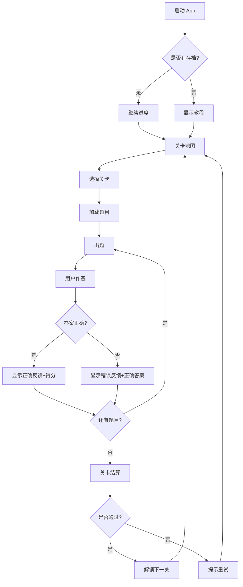

# AI 时代交互设计新方法调研报告

> **调研目标**：为 Guitar Lab 项目（非专业设计者主导）梳理 AI 时代可落地的交互设计新范式、新工具与新流程。
> **调研时间**：2026-04-25
> **适用读者**：无专业设计背景的产品开发者、独立开发者

---

## 1. 核心发现：交互设计正在从 UX 走向 AX

### 1.1 什么是 AX（AI Experience）？

传统 UX（User Experience）的核心假设是**用户主动操作界面**来完成目标。AX 的核心假设是**用户表达意图，AI 协助完成**。

| 维度 | UX 时代 | AX 时代 |
|------|---------|---------|
| 用户行为 | 点击、滑动、填写表单 | 说一句话、上传一张图、给一个意图 |
| 界面角色 | 信息的容器 + 操作的载体 | 对话的媒介 + 意图的澄清器 |
| 错误处理 | 表单验证 + 红色提示 | 自然语言澄清 + 多轮对话修正 |
| 信息架构 | 导航菜单、层级结构 | 即时生成、上下文感知 |
| 设计重心 | 降低操作成本 | 降低表达成本 + 建立信任 |

### 1.2 对非专业设计者的最大利好

AI 正在抹平专业设计壁垒。2025-2026 年的 AI 设计工具已经让**非专业人员可以在数小时内完成过去需要数天的交互流程设计**。

关键变化：
- **从"画图"到"说话"**：用自然语言描述需求，AI 直接生成可点击的原型
- **从"学习工具"到"对话工具"**：不需要掌握 Figma 的图层系统，只需要会描述
- **从"单点设计"到"全流程生成"**：从需求描述 → 流程图 → 多页面原型 → 可运行代码，AI 可以一气呵成

---

## 2. AI 辅助交互设计的五大新方法

以下方法按**从易到难**排序，非专业人员建议按顺序逐步尝试。

---

### 方法 1：AI 对话式需求拆解（最推荐入门）

**核心思想**：把你脑中模糊的产品想法，通过与 AI 对话逐步拆解成清晰的用户旅程和页面流程。

**操作流程**：
```
你：我想做一个吉他指板记忆游戏，用户要通过答题来熟悉指板上的音名。
AI：好的，让我帮你梳理一下核心流程。首先，用户打开 App 后看到什么？
你：应该有个开始界面，然后进入游戏...
AI：游戏内的答题流程是：出题 → 用户作答 → 反馈 → 下一题。这个循环对吗？
你：对，但不同难度要有不同的题型...
```

**关键技巧**：
1. **先讲"用户故事"，再讲"功能"**：不要说"我要一个排行榜"，要说"用户练完一组题后，想知道自己比上次进步了多少"
2. **让 AI 追问**：主动要求 AI "问我 5 个关键问题来帮助我完善这个流程"
3. **迭代细化**：第一轮对话得到大纲，第二轮细化每个页面的元素，第三轮定义异常流程（如答错时怎么办）

**适用场景**：项目初期，把脑海中的想法结构化。

**推荐工具**：Claude、ChatGPT、Kimi（任何支持长上下文的大模型均可）

---

### 方法 2：AI 生成用户旅程图（User Journey Map）

**核心思想**：让 AI 以结构化格式输出用户从"发现 App"到"成为重度用户"的完整旅程，标注每个节点的情绪、痛点和设计机会。

**提示词模板**：
```
请为【产品名】生成一张用户旅程图，格式如下：

阶段 | 用户行为 | 用户想法 | 情绪曲线(1-5) | 痛点 | 设计机会
-----|----------|----------|--------------|------|----------
发现 | ... | ... | ... | ... | ...
首次使用 | ... | ... | ... | ... | ...
... | ... | ... | ... | ... | ...

用户画像：【描述你的目标用户】
核心场景：【描述用户最常使用的场景】
```

**进阶用法**：
- 让 AI 基于旅程图自动提出"哪些环节可以用 AI 能力优化"
- 让 AI 对比"传统 UX 方案 vs AI 加持方案"

---

### 方法 3：AI 生成交互流程图（Flow Chart）+ 页面关系图

**核心思想**：用自然语言描述功能，让 AI 输出 Mermaid 语法或文本格式的流程图，再导入可视化工具渲染。

**示例（Guitar Lab 的实际应用）**：

```
用户：请为我生成吉他指板记忆游戏的主交互流程图。
      包含：启动 → 关卡选择 → 游戏中(出题→作答→反馈) → 结算 → 重玩/下一关。
      考虑答错时的提示流程、暂停流程、时间耗尽流程。
```

AI 输出：


**工具链**：
1. AI 生成 Mermaid 语法
2. 粘贴到 [Mermaid Live Editor](https://mermaid.live/) 或 [Excalidraw](https://excalidraw.com/) 渲染
3. 导出为图片插入文档

---

### 方法 4：AI 生成可点击原型（从文字到可交互界面）

**核心思想**：用自然语言描述页面，AI 直接生成包含页面跳转、按钮点击、状态变化的可交互原型。

**2026 年主流工具对比**：

| 工具 | 核心能力 | 是否适合非专业人员 | 是否免费 | 代码导出 |
|------|---------|------------------|---------|---------|
| **UXbot** | 流程画布 + 多页面一次性生成 + 内置模拟器 | ⭐⭐⭐ 极高 | 有免费额度 | HTML/Vue/Kotlin/Swift |
| **Figma + AI** | 单屏 UI 生成 + 强大组件生态 | ⭐⭐ 中等（需学基础操作） | 有免费版 | 否（需配合其他工具） |
| **v0.dev (Vercel)** | 文字描述 → React 组件 → 可预览网页 | ⭐⭐⭐ 极高 | 有免费额度 | React/Next.js |
| **Claude Artifacts** | 对话中直接生成可交互 HTML | ⭐⭐⭐ 极高 | 免费 | HTML/CSS/JS |
| **Figma-to-Code 插件** | 将 Figma 设计稿转为前端代码 | ⭐ 需先会 Figma | 部分免费 | React/Vue/Flutter |

**非专业人员推荐路径**：
```
第 1 步：用 Claude/ChatGPT 生成单页面 HTML 原型（零门槛）
        ↓
第 2 步：将多个页面串成可点击流程（手动加链接或让 AI 帮忙）
        ↓
第 3 步：需要更精细调整时，导入 Figma 或 UXbot
```

**实操示例（Claude Artifacts 模式）**：
```
请为我生成一个可交互的 HTML 页面：吉他指板记忆游戏的答题界面。
要求：
- 顶部显示当前关卡和得分
- 中间显示指板图（SVG 绘制），高亮一个位置
- 底部是音名选择器（C D E F G A B + ♮ # b）
- 选择音名后自动判断对错，显示绿色/红色反馈
- 点击"下一题"进入新题目
- 使用 Tailwind CSS 样式，响应式布局
```

---

### 方法 5：AI 辅助可用性测试（设计验证）

**核心思想**：在开发前，让 AI "扮演用户"来测试你的交互流程，提前发现困惑点和断点。

**三种测试方式**：

**方式 A：AI 走查（Heuristic Evaluation）**
```
请作为 UX 专家，对以下交互流程进行走查：
【粘贴你的流程描述】

请从以下维度给出问题清单：
1. 用户是否清楚当前在哪里、能去哪里？
2. 是否有操作后无反馈的情况？
3. 错误处理是否友好？
4. 认知负荷最高的环节是什么？
5. 哪些步骤可以用 AI 简化？
```

**方式 B：AI 角色扮演（模拟用户）**
```
请扮演一位刚学吉他 3 个月的新手用户，第一次打开这个 App。
你在每个页面会想什么？会怎么操作？哪里会让你困惑？
```

**方式 C：AI 生成测试任务 + 预期结果**
```
请为以下功能生成 5 个可用性测试任务：
【描述功能】

每个任务包含：任务描述、成功标准、可能的用户错误路径。
```

---

## 3. 针对 Guitar Lab 的具体建议

### 3.1 当前设计状态诊断

基于现有文档 (`guitar-fretboard-game-design.md` 和 `question-bank-architecture.md`)，项目已有：
- ✅ 清晰的乐理模型和玩法组合（Level 1~6）
- ✅ 答题交互规范（答案类型决定输入方式）
- ✅ 题库系统的配置化架构
- ❌ **缺少**：完整的用户旅程流程图、页面关系图、状态流转定义

### 3.2 推荐的 AI 辅助设计流程（针对本项目）

作为非专业人员，建议按以下 **7 天流程** 完成交互设计：

```
Day 1: 需求对话
       └── 与 AI 深度对话 2-3 轮，把脑海中的想法变成结构化大纲
       └── 输出：产品功能清单 + 用户故事列表

Day 2: 用户旅程
       └── 用 AI 生成用户旅程图（发现 → 首次使用 → 日常练习 → 进阶挑战）
       └── 输出：用户旅程表格 + 关键痛点标注

Day 3: 核心流程图
       └── 用 AI 生成 Mermaid 流程图：答题循环、关卡解锁、设置流程
       └── 输出：3-5 张核心流程图

Day 4: 页面清单 + 关系图
       └── 列出所有页面，定义页面之间的跳转关系
       └── 输出：页面关系图 + 每个页面的核心元素清单

Day 5: 低保真原型
       └── 用 Claude/v0.dev 生成核心页面的可交互 HTML 原型
       └── 优先做：答题界面、关卡选择、结算界面
       └── 输出：3-5 个可点击的 HTML 文件

Day 6: AI 可用性走查
       └── 让 AI 从"新手吉他手"和"有经验用户"两个视角审视原型
       └── 输出：问题清单 + 优化建议

Day 7: 迭代 + 设计文档
       └── 根据走查结果修改原型
       └── 整理成交互设计文档（可放入 docs/product/）
```

### 3.3 Guitar Lab 中特别需要关注的交互设计问题

基于现有设计文档，以下环节**最容易出现交互设计漏洞**，建议重点用 AI 辅助思考：

| 环节 | 风险 | 建议用 AI 做什么 |
|------|------|----------------|
| **多点点击题（如 N→P）** | 用户漏点/误点后如何反馈？ | 让 AI 设计 3 种反馈方案并对比 |
| **音名选择器（两区选择器）** | 新手不知道 E 不能升、F 不能降 | 让 AI 模拟新手操作路径，找出困惑点 |
| **关卡解锁流程** | 解锁条件不清晰，用户挫败感 | 让 AI 生成"解锁动画 + 条件说明"的交互方案 |
| **唱名 vs 音名切换** | 用户不理解为什么同一位置答案不同 | 让 AI 设计"调式指示器"的视觉方案 |
| **连续答错的挫败感** | 游戏化产品容易让用户放弃 | 让 AI 设计"提示系统 + 难度自适应"的交互逻辑 |
| **指板图多点高亮** | 视觉混乱，信息过载 | 让 AI 从视觉层次角度优化高亮策略 |

---

## 4. 尼尔森诺曼 NN/g 的 AX 设计原则（2024）

作为非专业人员，不需要背诵所有设计原则，但可以记住这 **5 条 AX 铁律**：

1. **用户能够容易地使用提示词**
   - 如果产品内有 AI 功能，界面要引导用户有效输入
   - 对 Guitar Lab 的启示：如果未来加入"AI 教练"，要设计好预设提示词按钮

2. **划清 AI 主导与用户主导的边界**
   - 绝不应该让 AI 替用户做所有决定
   - 对 Guitar Lab 的启示：AI 可以推荐关卡，但不能自动替用户选择

3. **多模态交互设计**
   - 结合语音、文本、控件输入
   - 对 Guitar Lab 的启示：如果加入听力训练，要考虑"播放按钮 → 视觉反馈 → 文字提示"的多模态配合

4. **渐进式建立信任**
   - 让用户从发现、尝试到依赖 AI 功能，需要平滑过渡
   - 对 Guitar Lab 的启示：新玩法（如 Level 3 音程题）首次出现时要有引导教程

5. **品牌下的 AI 人格化**
   - 如果有 AI 助手，它应该有符合品牌的人格和语气
   - 对 Guitar Lab 的启示：如果加入"吉他教练"角色，它的语气应该是鼓励型而非评判型

---

## 5. 推荐工具清单（按场景）

### 5.1 思维发散 / 需求梳理
- **Claude / ChatGPT / Kimi**：长对话梳理需求、生成用户旅程
- **Notion AI**：在文档中直接让 AI 帮你扩展思路

### 5.2 流程图 / 信息架构
- **Mermaid + AI**：AI 生成语法，Mermaid Live Editor 渲染
- **Excalidraw**：手绘风格流程图，有 AI 辅助插件
- **FigJam + AI**：协作白板，Figma 生态

### 5.3 可交互原型
- **Claude Artifacts**：零门槛，对话中直接生成可点击 HTML
- **v0.dev**：文字描述 → React 组件，适合有前端基础的人
- **UXbot**：全流程 AI 生成，从需求到可运行代码（2026 年新工具）
- **Figma + AI 插件**：适合需要精细视觉调整时

### 5.4 设计验证
- **AI 角色扮演**：让大模型模拟用户（零成本）
- **Microsoft Clarity**（后期）：真实用户热力图分析（免费）

---

## 6. 非专业人员避坑指南

| 坑 | 为什么 | 怎么避免 |
|----|--------|---------|
| **过度设计** | AI 能生成太多方案，容易在原型阶段陷入细节 | 先定义"MVP 必须有的 3 个页面"，其他后期再说 |
| **忽视异常流程** | 只设计"Happy Path"，没考虑错误/空状态 | 每个流程都问 AI "用户在这里可能犯什么错？" |
| **追求视觉完美** | 非专业人员花太多时间调颜色/间距 | 先用 Tailwind 默认样式，视觉美化放到开发后期 |
| **流程与实现脱节** | 设计的交互技术上很难实现 | 让 AI 评估"这个设计方案的前端复杂度" |
| **忽视可访问性** | 颜色对比度不足、不支持键盘操作 | 用 AI 检查"这个设计对色弱用户友好吗？" |

---

## 7. 下一步行动建议

如果你现在就要开始为 Guitar Lab 设计交互流程，建议立即做这 3 件事：

1. **今晚（30 分钟）**：打开 Claude/Kimi，用"方法 1"对话式拆解 Guitar Lab 的完整用户流程
2. **明天（1 小时）**：用"方法 3"生成核心流程的 Mermaid 图，保存到 `docs/product/` 
3. **本周末（2-3 小时）**：用"方法 4"生成 3 个核心页面的可交互 HTML 原型（答题页、关卡页、结算页）

这三个产出物将直接替代传统设计师的"交互设计文档"，并可以直接指导前端开发。

---

## 参考来源

- 兰亭妙微《AI交互设计进阶指南》（2026-04）
- 即时设计《产品设计AI工具完全指南》（2026-04）
- CSDN《2026年帮设计师快速生成交互流程的AI工具推荐》（2026-04）
- MEIA《2026科技中的设计报告》（2026-03）
- 知乎《AI 开创的新模式与新赛道：2026 年深度研究报告》（2026-03）
- arXiv《九论以用户为中心的设计：智能时代"用户体验3.0"范式》

---

> **文档状态**：调研完成，可直接用于指导 Guitar Lab 交互设计工作。
> **维护建议**：随着项目进展，可将本报告中生成的流程图、原型链接补充到本文档末尾作为附录。
