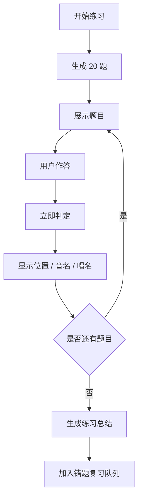

# Guitar Lab — MVP 最小练习闭环规格

> 日期：2026-05-01  
> 前置文档：`docs/product/learning-goal-calibration.md`  
> 目标：定义第一版可运行原型的最小训练闭环，用真实练习验证 Guitar Lab 是否能帮助初学者更快建立“六线谱/指板位置 -> 音名 -> 唱名”的自动化反应。

---

## 1. MVP 核心判断

第一版 MVP 不做完整的 Level 1~6 训练系统，而是聚焦一个最小但真实有用的练习闭环：

```text
出题 -> 作答 -> 即时反馈 -> 记录表现 -> 重复薄弱点
```

服务的核心能力是：

```text
P_tab / P_board -> N -> S
六线谱/指板位置 -> 音名 -> 当前调唱名
```

其中 G 大调是重点训练对象，C 大调用于建立对照和降低初始挫败感。

---

## 2. 目标用户与使用场景

### 2.1 目标用户

当前 MVP 只服务一个非常具体的用户画像：

- 吉他初学者
- 能弹简单歌曲
- 能看六线谱
- 演奏主要依赖手部肌肉记忆
- 想知道自己弹的是什么音，并能逐渐唱出旋律
- G 调不如 C 调熟练

### 2.2 典型使用场景

用户每天打开 App 练习 5-10 分钟：

1. 选择今天练习 `G 大调`
2. 选择 `0-5 品`
3. 系统快速出题
4. 用户通过音名选择器或唱名按钮回答
5. 每题立即看到正确位置、音名、唱名
6. 答错或反应慢的题稍后再次出现
7. 练习结束后看到正确率、平均反应时间、薄弱音

---

## 3. 首版范围

### 3.1 调性

首版只支持：

```text
C 大调
G 大调
```

优先级：

1. G 大调
2. C 大调

原因：

- C 大调没有升降号，适合建立基础信心
- G 大调是用户当前明确薄弱点
- G 大调引入 F#，能训练“同样位置在不同调内的唱名关系”

### 3.2 指板范围

首版只支持：

```text
0-5 品
1-6 弦
```

说明：

- 覆盖常见开放把位
- 适合初学者日常歌曲
- 包含 G 大调关键音 F#
- 暂不做 6 品以上、CAGED 把位、高把位训练

### 3.3 媒介

首版支持两种题目展示媒介：

| 媒介 | 用途 | 首版形态 |
|------|------|----------|
| 指板图 `P_board` | 主要训练界面 | SVG 高亮单个位置 |
| 六线谱 `P_tab` | 贴近真实读谱 | SVG 展示单个音符位置 |

首版不做滚动六线谱、不做多音和弦、不做完整乐句。

---

## 4. 首批题型

### 4.0 体验反馈后的调整（2026-05-01）

第一轮可玩原型体验后，MVP 闭环做如下调整：

- 音名输入从“字母 + 升降号 + 提交”改为“一键音名按钮”，减少答题摩擦
- `P_board -> N/S` 题目只展示一个指板，不再重复出现两遍
- 每题增加音高播放，并支持手动重播，帮助同时记忆位置、音名、唱名与实际音高
- 增加 `N + K -> S` 强化题，专门训练“已知音名，在当前调里快速反应唱名”的能力
- 指板任意位置在任意时刻都应可点击发音，让音高记忆和手指位置直接绑定
- 音色应尽量接近吉他拨弦，而不是普通电子提示音

其中第 4 点来自用户明确反馈：

```text
给出指板位置时可以知道是 D，
但从 D 转换到 G 大调下的 Sol 反应很慢。
```

因此 MVP 不应只训练 `P -> N` 和 `P -> S`，还要显式训练中间链路：

```text
N + K -> S
```

### 4.1 P0：指板位置 -> 音名

```text
P_board -> N
```

题目：

> 指板上高亮一个位置，请回答它是什么音名。

输入：

- 一键音名选择器
- 首版展示 C / C# / D / D# / E / F / F# / G / G# / A / A# / B

首版规则：

- 正确答案统一使用项目内部标准音名
- G 大调中 F# 必须显示为 F#
- 暂不接受等音替代，如 Gb 不算 F#

训练目的：

- 建立“位置 -> 绝对音名”的自动反应

### 4.2 P0：指板位置 + 调性 -> 唱名

```text
P_board + K -> S
```

题目：

> 在 G 大调中，指板上这个位置唱什么？

输入：

- 唱名选择器
- Do / Re / Mi / Fa / Sol / La / Si

规则：

- 使用首调唱名法
- G 大调中：G=Do, A=Re, B=Mi, C=Fa, D=Sol, E=La, F#=Si
- C 大调中：C=Do, D=Re, E=Mi, F=Fa, G=Sol, A=La, B=Si

训练目的：

- 建立“位置 -> 调内功能/唱名”的自动反应
- 帮助用户把弹奏动作转化为可唱旋律

### 4.3 P1：六线谱位置 -> 音名

```text
P_tab -> N
```

题目：

> 六线谱上出现一个数字，请回答它是什么音名。

输入：

- 音名选择器

首版形态：

- 单个六线谱音符
- 不滚动
- 不限制节奏

训练目的：

- 更贴近用户真实痛点：看谱时知道自己弹的是什么音

### 4.4 P1：六线谱位置 + 调性 -> 唱名

```text
P_tab + K -> S
```

题目：

> 在 G 大调中，六线谱上这个位置唱什么？

输入：

- 唱名选择器

训练目的：

- 从“看到谱子能弹”推进到“看到谱子能唱”

### 4.5 P2：音名 -> 指板位置

```text
N -> P_board
```

题目：

> 请在 0-5 品范围内找出所有 F#。

输入：

- 指板图多点点击

首版策略：

- 可作为第二阶段题型
- 不阻塞第一版最小闭环

原因：

- 多点点击的校验和反馈更复杂
- 但它对补全指板地图很有价值

### 4.6 P0：音名 + 调性 -> 唱名

```text
N + K -> S
```

题目：

> 在 G 大调中，D 唱什么？

输入：

- 唱名选择器

训练目的：

- 强化“音名 -> 当前调唱名”的中间链路
- 解决用户已能认出 D，但不能快速反应 G 大调 Sol 的问题
- 让位置题反馈中的“音名 / 唱名”绑定真正自动化

---

## 5. 单次练习会话

### 5.1 默认练习配置

第一版默认入口应尽量减少选择负担。

推荐默认配置：

```json
{
  "key": "G major",
  "fretRange": [0, 5],
  "stringRange": [1, 6],
  "questionCount": 20,
  "questionTypes": [
    "board-to-note",
    "board-to-solfeggio",
    "tab-to-note",
    "tab-to-solfeggio",
    "note-to-solfeggio"
  ]
}
```

### 5.2 会话流程



### 5.3 题目配比

首版建议：

| 题型 | 比例 |
|------|------|
| `P_board -> N` | 30% |
| `P_board + K -> S` | 25% |
| `P_tab -> N` | 20% |
| `P_tab + K -> S` | 15% |
| `N + K -> S` | 10% |

如果用户选择 G 大调，则所有唱名题均以 G 大调为上下文。

---

## 6. 即时反馈设计

每题作答后，不只显示对错，而要显示完整绑定关系：

```text
位置：3 弦 2 品
音名：A
G 大调唱名：Re
音高：可重播
```

### 6.1 答对反馈

显示内容：

- 正确
- 用户耗时
- 位置 / 音名 / 唱名完整信息

目的：

- 强化正确映射
- 不让用户只追求“过题”

### 6.2 答错反馈

显示内容：

- 用户答案
- 正确答案
- 位置 / 音名 / 唱名完整信息
- 该题加入稍后复习

示例：

```text
你选了：Fa
正确是：Si
位置：1 弦 2 品
音名：F#
G 大调唱名：Si
```

### 6.3 反应慢反馈

即使答对，如果耗时明显偏长，也应记录为“需巩固”。

首版阈值建议：

```text
音名题 > 4 秒：标记为反应慢
唱名题 > 5 秒：标记为反应慢
```

这些题不算错，但会提高后续出现权重。

---

## 7. 错题与薄弱点重复

首版不需要复杂的间隔重复算法，但需要一个简单有效的策略。

### 7.1 题目权重

每个位置记录以下数据：

```typescript
interface PositionPracticeStats {
  position: FretPosition;
  key: 'C major' | 'G major';
  noteName: string;
  solfeggio: string;
  attempts: number;
  correct: number;
  wrong: number;
  slow: number;
  averageResponseMs: number;
}
```

### 7.2 重复规则

一题进入复习队列的条件：

- 答错
- 答对但反应慢
- 涉及 G 大调 F#

复习题出现策略：

```text
每 5 题插入 1 题复习题
```

若复习队列为空，则正常随机出题。

### 7.3 F# 特殊权重

由于 G 大调是当前重点，且 F# 是 G 大调区别于 C 大调的关键音，首版应提高 F# 相关题目出现率。

建议：

```text
G 大调练习中，F# 相关题目占比约 15%-20%
```

注意：这不是让用户机械背 F#，而是帮助建立 G 大调中的 Si 感。

---

## 8. 练习总结

单次练习结束后显示：

| 指标 | 用途 |
|------|------|
| 正确率 | 判断整体掌握情况 |
| 平均反应时间 | 判断是否自动化 |
| 最慢的 3 个位置 | 暴露薄弱点 |
| 最常错的音名/唱名 | 指导下一次练习 |
| F# 正确率 | 检查 G 调关键点 |

首版总结文案应保持具体：

```text
G 大调 0-5 品：20 题
正确率：80%
平均反应：3.8 秒
最需要巩固：1 弦 2 品 F# / Si
```

---

## 9. 7 天验证计划

MVP 做出来后，用 7 天验证是否真的帮助学习。

### 第 1 天

目的：建立基线。

记录：

- G 大调 0-5 品音名正确率
- G 大调 0-5 品唱名正确率
- 平均反应时间
- F# 相关题目表现

### 第 2-6 天

每天练习 5-10 分钟。

规则：

- 优先 G 大调
- 每天至少 1 轮 20 题
- 如果愿意，可追加 C 大调作为对照

### 第 7 天

目的：复测。

判断是否达成：

- G 大调音名平均反应时间降低 30%
- G 大调唱名平均反应时间降低 30%
- 0-5 品正确率达到 85% 以上
- F# 相关题目正确率达到 80% 以上

如果达不到，先优化练习闭环，不急着扩展新功能。

---

## 10. 首版不做清单

为了保证 MVP 真正落地，以下内容明确不进入第一版：

- 完整关卡地图
- Level 3 音程几何
- Level 4 和弦内音
- Level 5 CAGED / 把位音阶
- Level 6 多声部分析
- 节拍器
- 节奏打分
- 用户账号
- 云同步
- 社交分享
- 自定义题库导入
- 移动端 Capacitor 打包

这些功能并非不重要，而是暂时不能证明“用户是否真的通过这个练习变强”。

---

## 11. 下一步实现顺序

建议按以下顺序进入代码实现：

1. 乐理基础函数
   - 计算标准调弦下任意位置的音名
   - 计算 C/G 大调中的首调唱名
   - 获取 0-5 品范围内的所有位置
2. SVG 指板图
   - 展示 0-5 品
   - 高亮单点
   - 支持点击位置
3. 音名选择器
   - 字母 + 升降号两区选择
   - 支持 F# 等首版必要音名
4. 唱名选择器
   - Do/Re/Mi/Fa/Sol/La/Si
5. 简单六线谱组件
   - 展示单个位置
6. MVP 游戏循环
   - 生成题目
   - 作答
   - 即时反馈
   - 下一题
   - 总结
7. 简单本地记录
   - 正确率
   - 反应时间
   - 错题/慢题

---

## 12. 产品原则

第一版的判断标准只有一个：

> 它是否帮助用户更快把“我按在哪里”转化为“我弹的是什么音、在这个调里唱什么”。

如果某个功能不能服务这个目标，就暂缓。
